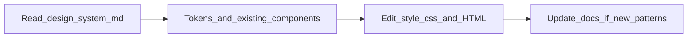

# Hubiyan portfolio — design system (authoritative)

Read this file **before** adding pages, components, or tokens. It complements the reference material in [`design-system/`](design-system/) and the live source in [`style.css`](style.css), [`index.html`](index.html), and [`script.js`](script.js).

---

## How the flow works (read this first)

The pipeline is **not** “generate `style.css` from this file.” **`style.css` is what ships** in the browser; this document is the **contract and checklist** authors follow so new work stays consistent.



**Strict order for a new page or feature:**

1. **Read** this file and the linked [`design-system/`](design-system/) references.
2. **Reuse** existing classes and tokens in [`style.css`](style.css) (and Bootstrap helpers) before inventing names.
3. **Implement** markup + CSS: new rules live in [`style.css`](style.css) under a clear section and, for labs, under a **page scope** (e.g. `body.ai-bro-lab`) so the rest of the site does not regress.
4. **Document** any **new** reusable component or variant here (and optionally in [`design-system/components.md`](design-system/components.md)) in the same change or immediately after—so the next “new project” reads the truth.

**Summary:** `design-system.md` → guides implementation → `style.css` + HTML; then update `design-system.md` when you add patterns. Not the reverse.

---

## Mandatory rules

1. **Single source of visual truth** — Production styles live in [`style.css`](style.css). Do not introduce parallel styling (inline `style=`, ad hoc `<style>` blocks, or duplicate frameworks) unless there is no alternative; if you must, document the exception in the PR / commit message.

2. **Tokens first, then classes** — Spacing, greys, blues, and shared surfaces use **`var(--spacing-*)`**, **`var(--grey-*)`**, **`var(--blue-*)`**, **`var(--bg-*)`** as already defined in `:root` / [`style.css`](style.css). If you need a new value, **add a new token** with a name that reflects role (e.g. `--spacing-21`) rather than repurposing an unrelated token. See [`design-system/tokens.md`](design-system/tokens.md).

3. **Compose layouts with existing utilities** — Use Bootstrap grid/utilities where the site already does (`d-flex`, `container`, `gap-*-box`, `res-0-520-*`). New layout helpers should follow the same naming flavor as [`design-system/layout-and-bootstrap.md`](design-system/layout-and-bootstrap.md).

4. **Do not rename `id`s or classes that [`script.js`](script.js) owns** — e.g. `#navBlurStack`, `#wave`, modal/carousel ids, testimonial drag hooks. If you rename, update JS in the same change. See [`design-system/behavior.md`](design-system/behavior.md) if present.

5. **Accessibility** — Preserve focus rings (`:focus-visible`), skip links, `aria-*` on interactive patterns, and `prefers-reduced-motion` behavior when extending animated components.

6. **Subpages (Prompts, labs)** — Reuse the **shared subpage shell** (nav + scroll strip + wave + Get in touch modal). Copy from the **Subpage shell — reference HTML** appendix below (optionally also save as `design-system/snippets/subpage-shell.html` in-repo). Relative paths depend on depth (Prompts: `../`; `lab/foo/`: `../../`).

7. **`.ds-*` twin classes (Prompts / labs)** — [`style.css`](style.css) pairs prompt-specific selectors (`.prompts-*`, `.prompt-*`) with **design-system twins** (`.ds-*`) so new pages get the same look **without** coupling to [`prompts.js`](prompts.js). **Never remove** the original `.prompts-*` / `.prompt-*` names from the Prompts page where JS depends on them. When editing rules, **update both sides of every comma-grouped selector** so twins stay identical.

8. **Changing the Prompts page look** — Any tweak to Prompts visuals must apply to **both** the legacy class and its `.ds-*` twin in the same rule block, and must be regression-checked against live `/prompts/`.

---

## Reference index

| Resource | Role |
|----------|------|
| **[`design-system.md`](design-system.md)** (this repo root) | **Authoritative** rules, **flow** (`style.css` ↔ docs), **lab component registry** (AI Bro), twin map, subpage HTML appendix |
| [`design-system/guideline.md`](design-system/guideline.md) | Folder entry + links |
| [`design-system/tokens.md`](design-system/tokens.md) | Colors, spacing scale, nav blur variables |
| [`design-system/components.md`](design-system/components.md) | Buttons, cards, sections, nav |
| [`design-system/layout-and-bootstrap.md`](design-system/layout-and-bootstrap.md) | `.container`, `gap-*-box`, breakpoints |
| [`design-system/README.md`](design-system/README.md) | Folder overview |

---

## Lab / interactive tool components (AI Bro Detector scope)

These classes are **specified here first**; implementations belong in [`style.css`](style.css) under **`body.ai-bro-lab`** (and optionally a section comment `/* ----- AI Bro Detector lab ----- */`). They compose with existing primitives: [`card`](design-system/components.md#cards-and-surfaces), [`my-button`](design-system/components.md#buttons), [`section-title` / `section-description`](design-system/tokens.md), [`chip`](design-system/components.md#chips--tags) where appropriate.

**Scope rule:** Every selector for these components should be rooted or compounded: `body.ai-bro-lab .ai-bro-*` (or equivalent), so portfolio home and Prompts are unaffected.

| Component | Class(es) | Role |
|-----------|-----------|------|
| **Privacy callout** | `.ai-bro-privacy` | Short legal/UX note; variant `.ai-bro-privacy--compact` for tighter stacks. Use token-based border/background; typically nested in `.card` or as a bordered strip. |
| **Paste target** | `.ai-bro-paste` | Large focusable region (`tabindex="0"`). **Variants:** `.is-empty` (placeholder copy), `.is-focused` (keyboard focus), `.is-filled` (has captured content). |
| **Paste hint** | `.ai-bro-paste-hint` | Helper line inside paste region; use `.section-description` or smaller token-based type. |
| **Preview panel** | `.ai-bro-preview` | Container for pre-submit summary. **Variant:** `.ai-bro-preview--hidden` when nothing to show. |
| **Text excerpt** | `.ai-bro-preview-text` | Truncated plain-text preview; **state** `.is-truncated` if JS adds ellipsis. |
| **URL list** | `.ai-bro-url-row` + `.ai-bro-url-chip` | Row of detected links; chips may reuse `.chip` or stay lab-scoped. **Variant:** `.ai-bro-url-chip--invalid` for failed client-side validation. |
| **Image thumb** | `.ai-bro-thumb` + `.ai-bro-thumb-img` | Clipboard image preview; **state** `.is-too-large` when over limit. |
| **Toolbar** | `.ai-bro-toolbar` | Flex row: Clear, Analyze, optional secondary actions. Use `gap-*-box` with `.my-button`. |
| **Analyze control** | `.ai-bro-analyze` | Primary button wrapper; **states:** `.is-loading` (disabled + `aria-busy`), `.is-disabled` when no payload. |
| **Status message** | `.ai-bro-status` | Errors and inline API messages; **`role="status"`** or **`role="alert"`** for errors. **Variants:** `.ai-bro-status--error`, `.ai-bro-status--success` (token colors, not hard-coded hex unless mapped). |
| **Results** | `.ai-bro-result` | Post-response block. **Variant:** `.ai-bro-result--empty` before first run. |
| **BS dial** | `.ai-bro-dial` | Semicircle gauge shell. |
| **Needle** | `.ai-bro-dial-needle` | Rotates with `transform`; **must** respect `prefers-reduced-motion` (static position or instant snap). |
| **Score readout** | `.ai-bro-score` | Numeric `bs_score` + label cluster. |
| **Reading legend** | `.ai-bro-legend` | Explains `bs_reading` (positive = more BS / hype, not praise). **Variant:** `.ai-bro-legend--mixed` / `--negative` / `--positive` for subtle emphasis using grey/blue tokens only. |
| **Reasons list** | `.ai-bro-reasons` | `ul` / `li` with spacing from `--spacing-*`. |
| **Signals** | `.ai-bro-signals` + `.ai-bro-signal` | Optional collapsible block; `.ai-bro-signal-kind` for `kind` label. |
| **Input summary** | `.ai-bro-input-summary` | Muted “what we analyzed”; pair with `.section-description` or a dedicated grey token line height. |

**Variants recap (state/modifiers):**

- Paste: `.is-empty` | `.is-focused` | `.is-filled`
- URL chip: default | `.ai-bro-url-chip--invalid`
- Thumb: default | `.is-too-large`
- Analyze: `.is-loading` | `.is-disabled`
- Status: `.ai-bro-status--error` | `.ai-bro-status--success`
- Result: `.ai-bro-result--empty`
- Legend: `.ai-bro-legend--negative` | `.ai-bro-legend--mixed` | `.ai-bro-legend--positive`
- Privacy: default | `.ai-bro-privacy--compact`

When `/lab/ai-bro-detector/` ships, **mirror** any final class names and states from [`style.css`](style.css) into this table if they differ during implementation.

---

## Subpage shell (HTML contract)

Subpages share this structure:

- `body` class: `prompts-page` **or** `ds-subpage` (and optional page-specific class).
- Top: skip link → `.my-nav` (blur stack, floater, logo, primary CTA, home icon).
- `.full-width-scroller` + `#confetti-trigger` + `#wave`.
- **One** `#exampleModal` Get in touch block (Bootstrap), matching portfolio copy.
- `main` typically: `class="container … d-flex flex-column gap-40-box"` plus **`.prompts-content` + `.ds-subpage-main`** for the narrow column pattern.

Canonical HTML file: [`design-system/snippets/subpage-shell.html`](design-system/snippets/subpage-shell.html) (paths assume `/prompts/`; adjust for deeper routes). See also the **Appendix: Subpage shell — reference HTML** at the end of this file.

### Prompts `index.html` — additive classes (no removals)

The Prompts page includes these **in addition to** legacy classes (for [`prompts.js`](prompts.js)):

- `body`: `prompts-page ds-subpage`
- `main`: `ds-subpage-main`
- `header.prompts-hero`: `ds-subpage-hero`
- `h1#prompts-hero-title.prompts-hero-title`: `ds-subpage-hero-title`
- `p.prompts-hero-subtitle`: `ds-subpage-hero-subtitle`
- `div.prompts-grid`: `ds-card-grid-2`
- `article.prompt-block`: `ds-editorial-card`
- `div.prompt-block-header`: `ds-editorial-card-header`
- `h2.prompt-card-title`: `ds-editorial-card-title`
- `button.prompt-copy-btn`: `ds-clipboard-action`
- `p.prompt-body`: `ds-editorial-card-body`
- `#prompts-copy-status.prompts-copy-status`: `ds-live-toast`

---

## Prompts / editorial UI — class twin map

When building a new lab page that should **look like** Prompts but **not** load [`prompts.js`](prompts.js), prefer **`.ds-*`** in markup. The Prompts page should **add the same `.ds-*` classes alongside** existing classes so one CSS rule set drives both (no visual drift).

| Legacy (keep on Prompts for JS / history) | Twin (use on new subpages) |
|-------------------------------------------|----------------------------|
| `body.prompts-page` (padding-bottom) | `body.ds-subpage` |
| `.prompts-page .main-title` | `body.ds-subpage .main-title` |
| `.prompts-hero` | `.ds-subpage-hero` |
| `.prompts-hero-title` | `.ds-subpage-hero-title` |
| `.prompts-hero-nowrap` | `.ds-subpage-hero-nowrap` |
| `.prompts-hero-title-star-slot` | `.ds-subpage-hero-title-star-slot` |
| `.prompts-hero-title-star` | `.ds-subpage-hero-title-star` |
| `.prompts-hero-scramble` (+ `--measuring`, `.is-single-line`, `.is-multiline`, `-line`) | `.ds-subpage-hero-scramble` (+ same modifiers / `-line`) |
| `.prompts-hero-subtitle` | `.ds-subpage-hero-subtitle` |
| `.prompts-content` | `.ds-subpage-main` |
| `.prompts-grid` | `.ds-card-grid-2` |
| `.prompt-block` | `.ds-editorial-card` |
| `.prompt-block-header` | `.ds-editorial-card-header` |
| `.prompt-ascii-box` / `.prompt-ascii-pre` | `.ds-ascii-badge` / `.ds-ascii-badge-pre` |
| `.prompt-card-title` | `.ds-editorial-card-title` |
| `.prompt-body` | `.ds-editorial-card-body` |
| `.prompt-copy-btn` | `.ds-clipboard-action` |
| `.prompts-copy-status` | `.ds-live-toast` |

**`prompts.js` coupling** — Still requires: `#prompts-hero-title`, `.prompts-hero-subtitle`, `.prompts-grid`, `.prompt-block`, `.prompt-card-title`, `.prompt-copy-btn`, `#prompts-copy-status`, and scramble class names it sets in the DOM. Do not replace those with only `.ds-*` on the live Prompts page.

**Shared inner copy-button icons** — `.btn-icon-copy`, `.btn-icon-check` remain as today (Prompts-only usage in repo).

---

## Implementation checklist (Prompts twins in `style.css`)

**Implemented in-repo:** [`style.css`](style.css) comma-groups all `.ds-*` twins in the Prompts/subpage section; [`prompts/index.html`](prompts/index.html) includes additive twin classes. When **changing** these rules:

1. Keep section banner comment that documents `.ds-*` twins.
2. Update **both** legacy and `.ds-*` sides of every comma-grouped selector; **do not change property values** on only one side.
3. For complex selectors (e.g. scramble lines + `:not()`), add the parallel `.ds-subpage-hero-*` branch.
4. For `:has()` two-line title, keep all three branches listed in the twin map section above.
5. Mirror every responsive `@media` override for `.ds-*` selectors (including `body.ds-subpage .ds-subpage-main` mobile padding).

---

## Review gate

Before merging subpage or token work:

- [ ] No stray hard-coded colors that duplicate an existing `--grey-*` / `--blue-*` without justification.
- [ ] No new JS dependency on class names unless documented in [`design-system/behavior.md`](design-system/behavior.md) or this file.
- [ ] Prompts page screenshot or visual diff: **unchanged** after twin pass.
- [ ] New page uses `ds-subpage` + `ds-subpage-main` + components from the twin map instead of forking new look-alike classes.
- [ ] **Lab tools:** New `ai-bro-*` (or other scoped) classes are listed under **Lab / interactive tool components** once implemented in [`style.css`](style.css), or this file is updated in the same PR.

---

## Appendix: Subpage shell — reference HTML

Keep in sync with [`prompts/index.html`](prompts/index.html) (nav through modal). Replace skip-link `href` and label per page. **Do not** change `#exampleModal` or `#navBlurStack` without updating [`script.js`](script.js).

```html
<a href="#your-main-id" class="visually-hidden-focusable">Skip to main content</a>

<nav class="my-nav d-flex w-100 justify-content-center align-items-end">
    <div class="nav-blur-stack" id="navBlurStack" aria-hidden="true"></div>
    <div class="nav-floater d-flex align-items-center justify-content-center gap-32-box">
        <a href="../"></a>
        <div class="button-wrapper d-flex gap-04-box align-items-center res-0-520-w-100">
            <button type="button" class="my-button btn-primary res-0-520-w-100" data-bs-toggle="modal"
                data-bs-target="#exampleModal">
                Get in touch
            </button>
            <a href="../" class="btn my-button btn-seco icon-btn" aria-label="Go to portfolio home">
                
            </a>
        </div>
    </div>
</nav>

<div class="full-width-scroller">
    <div class="scroller-indicator"></div>
</div>

<div id="confetti-trigger" style="display:none;"></div>
<div id="wave"></div>

<div class="modal fade" id="exampleModal" tabindex="-1" aria-labelledby="exampleModalLabel" aria-hidden="true">
    <div class="modal-dialog">
        <div class="d-flex w-100 justify-content-end">
            <button type="button" class="btn-close" data-bs-dismiss="modal" aria-label="Close">
                
            </button>
        </div>
        <div class="modal-content d-flex flex-column gap-32-box">
            <div class="d-flex w-100 justify-content-between align-items-center">
                <h2 class="section-title modal-title text-center w-100">Get in touch</h2>
            </div>
            <div class="card d-flex flex-column gap-32-box align-items-center res-0-520-gap-16">
                <div class="d-flex flex-column align-items-center gap-16-box w-100">
                    <p class="button-cat text-center">Let's talk design!</p>
                    <div class="button-wrapper d-flex flex-column gap-04-box align-items-center w-100">
                        <div class="d-flex gap-08-box align-items-center">
                            <p class="btn-help-text help-pop">Say hi 👋🏻</p>
                            <div class="dot-div"></div>
                            <p class="btn-help-text help-pop">20-30 mins</p>
                            <div class="dot-div"></div>
                            <p class="btn-help-text lighter-help help-pop">Free!</p>
                        </div>
                        <a href="https://cal.com/hubiyan/quick-intro" target="_blank" rel="noreferrer noopener"
                            class="button-link w-100">
                            <button type="button" class="my-button btn-primary w-100">
                                Schedule a meeting
                                
                            </button>
                        </a>
                    </div>
                </div>
                <div class="divider"></div>
                <div class="d-flex flex-column align-items-center gap-16-box w-100">
                    <p class="button-cat">I'm most active on:</p>
                    <div class="button-wrapper d-flex gap-04-box align-items-center w-100">
                        <a href="https://www.linkedin.com/in/hubiyan/" target="_blank" rel="noreferrer noopener"
                            class="button-link w-100">
                            <button class="my-button btn-social w-100">
                                
                            </button>
                        </a>
                        <a href="https://www.instagram.com/hubiyxn/" target="_blank" rel="noreferrer noopener"
                            class="button-link w-100">
                            <button type="button" class="my-button btn-social w-100">
                                
                            </button>
                        </a>
                    </div>
                </div>
            </div>
        </div>
    </div>
</div>
```
